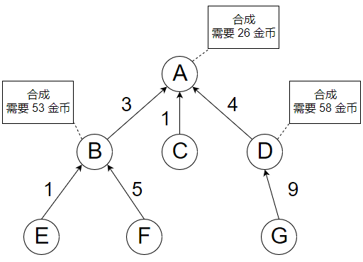

下图是一个装备系统的合成图谱，箭头指向的是合成之后的装备， 每合成一个装备需要消耗一些金币（标注在矩形框里面），箭头上的数字表示合成所需的材料数量。 比如，要合成n个装备A，需要消耗3n个装备B、1n个装备C、4n个装备D， 而且还需要消耗26n金币（装备B和装备D的合成与此类似）。

为了简单起见，下面题目的装备图谱都是一棵多叉树， 而且玩家最初只拥有指定数量的叶子节点的装备， 也就是图中的装备C、装备E、装备F和装备G。

注意，**下面的图谱只是一个例子**，作答的时候**不要局限于这个图谱**。



已知玩家拥有一些初级装备（叶子节点的装备）和n个金币，并且所有装备的合成都需要消耗金币，玩家需要合成尽可能多的某个装备（记为装备X），请用C#语言（前端）（后端用c++语言）计算出玩家最多可以合成出多少个装备X。

请在收到题目的一至两天内完成，提交的时候只需要提交源代码以及算法思路（注意代码质量以及运行效率，代码简洁的话不会超过100行）。为了规范输入输出，下面给出代码的基本结构，作答的时候不要修改Run函数的函数原型。

Yosa求贤若渴，但求一牛人同行！各位大大，算法题的测试占面试相当重要的比重，麻烦花些时间认真作答，事半功倍。

```cpp
public class Exam
{
   public class MaterialData
   {
       public ItemData item;   //合成所需的物品
       public int count;       //合成所需的该物品的数量
   }

   public class ItemData
   {
       public int id;  //物品 ID
       public int count;//当前拥有的物品数量
       public int costGold;//合成该物品所需的金币
       public List<MaterialData> materialList; //合成该物品所需的材料
   }

   /// <summary>
   /// 计算用 totalGold 金币最多可以合成的 item 装备的数量
   /// </summary>
   /// <param name="item">要合成的装备</param>
   /// <param name="totalGold">拥有的金币</param>
   /// <returns>可合成的 item 装备的最大数量</returns>
   public int Run(ItemData item, int totalGold)
   {
       return 0;
   }
}
```